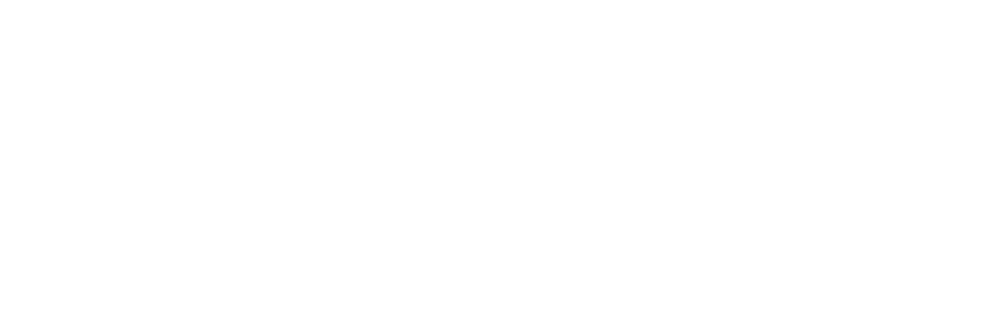
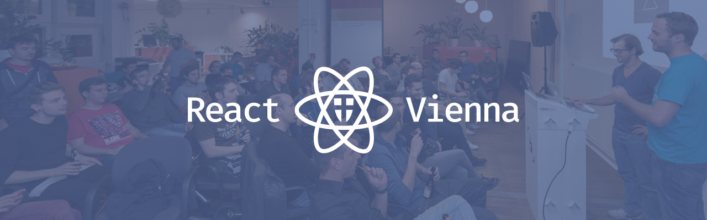

# ReactJS Vienna Meetup Branding

## Logo

[SVG version](ReactJS Vienna.svg)

[SVG version](ReactJS Vienna White.svg)

[SVG version](ReactJS Vienna Black.svg)

## Logo with text

[SVG version](ReactJS Vienna Text.svg)

[SVG version](ReactJS Vienna Text White.svg)

[SVG version](ReactJS Vienna Text Black.svg)

## Hero image

### Twitter (1280×400)

### Meetup.com (960×150)

